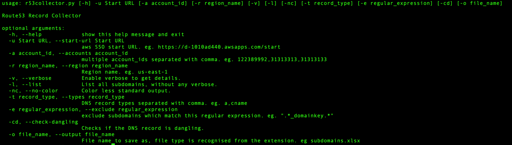

# Route53 Record Collector (r53collector)

## Overview
This Python tool collects DNS records from AWS Route53 across multiple accounts using AWS SSO (Single Sign-On). It provides various options for listing, filtering, storing and analyzing the data.





## Installation

Use the package manager [pip3](https://pip.pypa.io/en/stable/) to install foobar.

```bash
pip3 install r53collector
```


## Usage


`r53collector -u https://d-1010ad440.awsapps.com/start -cd -o myrecords.xlsx -v `
```bash
r53collector -u https://d-1010ad440.awsapps.com/start -a 144313609872,330936112098,692902471034 -t a,cname,aaaa -e "^_.*|.*_(domainkey|dkim).*" -cd -o myrecords.xlsx -v
```


## Detailed Features

''
''
''

  ### Every time you run this tool it will open up your default browser to authorize the device. You don't need any credentials or profiles separately to make it work.

- Run accross all accounts
  - With out using --accounts/-a, the tool will gather all accounts you have privilege to and fetch details of dns records. If you use --verbose/-v then it will show extra information you may need otherwise without --verbose/-v it will only show unique subdomains(record names). Example:  
    - _r53collector -u https://d-1010ad440.awsapps.com/start -v_
  ```python
  r53collector -u <SSO Start URL> -v
  
- Run accross selective account[s].
  - To get results from selective accounts, use --accounts/-a. Multiple accounts can be selected separated by comma. Example:
    - _r53collector -u https://d-1010ad440.awsapps.com/start -a 144313609872,330936112098,692902471034 -v_
  ```python
  r53collector -u <SSO Start URL> -a <Account IDs> -v

- Filter record types.
  - To get desired DNS record types only, use -types/-t. Multiple types can be selected separated by comma. Example:
    - _r53collector -u https://d-1010ad440.awsapps.com/start -t cname,a,aaaa_
  ```python
  r53collector -u <SSO Start URL> -t <Record Type> -v

- Exclude record names using regex.
  - If you want to filterout the undesired subdomains(record names) like containing _domainkey or _dkim or records starting with _, you can select regex after --exclude/-e. Example:
    - _r53collector -u https://d-1010ad440.awsapps.com/start -e "^\_.\*|.\*\_(domainkey|dkim).\*" -v_
  ```python
  r53collector -u <SSO Start URL> -e <Regex> -v

- Save output to a file.
  - If you want to save the output to a file, use --output/-o. You have two format options xlsx(recommended) and txt. Format is recognised from the filename extension. Txt extension is recommended only in case you want to store subdomains in a text file, which can be later used to feed other tools for reconnaissance . Example:
    - _r53collector -u https://d-1010ad440.awsapps.com/start -o myrecords.xlsx -v_
  ```python
  r53collector -u <SSO Start URL> -o <Output FileLocation> -v

- check if the record is dangling.
  - If you want to check whether the DNS record is dangling or not, use --check-dangling/-cd . Use output filename extension as xlsx along with it. Example: 
    - __r53collector -u https://d-1010ad440.awsapps.com/start -cd -o myrecords.xlsx -v_
  ```python
  r53collector -u <SSO Start URL> -cd -o <Output FileLocation> -v


## Contributing

Pull requests are welcome. For major changes, please open an issue first
to discuss what you would like to change.

Please make sure to update tests as appropriate.

## License

[](https://choosealicense.com/licenses/mit/)

  

## Author[s]

- [@maerifat](https://www.linkedin.com/in/maerifat)
